<p align="center">
  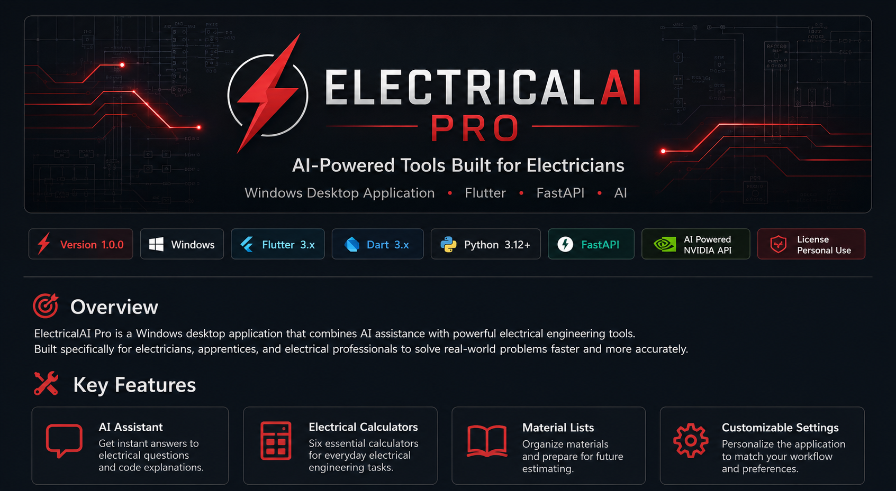
</p>

# ⚡ ElectricalAI Pro

<p align="center">

# ⚡ Your AI-Powered Electrical Workspace

**Designed by someone who understands the electrical trade. Built to make everyday work faster, smarter, and more efficient.**

</p>

<p align="center">

**ElectricalAI Pro** is an AI-powered Windows desktop application that combines intelligent electrical assistance, professional-grade calculators, and productivity tools into one modern application.

Built with **Flutter**, **Dart**, **FastAPI**, **Python**, and the **NVIDIA Build API**.

Version **1.0.1** is available for **Windows**, with **Android** and **iPhone** versions planned for future releases.

</p>

---

# Why ElectricalAI Pro Exists

Electricians rely on multiple tools every day.

A typical job may require switching between electrical calculators, AI assistants, notes, reference materials, estimation tools, and online resources just to answer a few questions or perform a simple calculation.

That constant switching interrupts workflow, wastes time, and makes it harder to stay focused on the job.

**ElectricalAI Pro** was created to solve that problem.

Instead of juggling multiple applications and websites, ElectricalAI Pro brings essential electrical tools together into one clean, easy-to-use desktop application designed specifically for electricians, apprentices, students, and electrical professionals.

Version 1 focuses on building a solid foundation by combining AI-powered assistance, professional electrical calculators, material planning tools, and a modern desktop experience. Future versions will continue expanding the platform with additional tools and mobile support.

---

# Project Vision

ElectricalAI Pro is more than a calculator application.

The long-term vision is to create a complete AI-powered productivity platform for the electrical industry.

Future versions will continue expanding beyond calculations into intelligent project management, document analysis, estimating, field productivity, and mobile access for technicians working in the field.

Version **1.0.0** represents the first major milestone toward that vision.

---

# Why I Built This

This project started with a simple observation.

Working around the skilled trades showed me how often electricians have to rely on several different applications just to complete everyday tasks. There are great calculators, great AI tools, great estimating software, and great note-taking applications—but they're all separate.

I wanted to explore whether those tools could be combined into one application that felt purpose-built for electricians.

At the same time, I wanted a project that would challenge me as a developer.

ElectricalAI Pro became an opportunity to combine real-world industry knowledge with modern software engineering while learning technologies such as Flutter, Dart, Python, FastAPI, REST APIs, AI integration, Git, and desktop application development.

Every feature included in Version 1 was built as part of that journey.

---

# Key Highlights

⭐ AI-powered Electrical Assistant

⭐ Six professional electrical calculators

⭐ Modern Windows desktop application

⭐ FastAPI REST API backend

⭐ Flutter user interface

⭐ Persistent application settings

⭐ Material planning tools

⭐ Modular architecture designed for future expansion

⭐ Built using modern full-stack development practices

⭐ Android and iPhone versions planned

---

# Features

ElectricalAI Pro combines intelligent assistance with practical electrical tools to help professionals work more efficiently throughout the day.

Rather than acting as a single-purpose calculator, the application is designed as a growing platform that brings multiple everyday resources together in one place.
## 🤖 AI Assistant

The built-in AI Assistant is designed to provide fast, natural-language support for electricians, apprentices, and students.

Instead of searching multiple websites or manuals, users can ask questions directly within the application and receive AI-generated responses through the integrated backend.

The assistant is intended to support learning and productivity by helping users understand electrical concepts, troubleshoot problems, and make informed decisions while working.

### Current Capabilities

- Electrical troubleshooting assistance
- Electrical theory explanations
- Installation guidance
- Material recommendations
- General electrical questions
- Learning support for apprentices and students

The AI Assistant communicates with the FastAPI backend, which securely processes requests and connects to the NVIDIA Build API to generate intelligent responses.

> **Note:** AI-generated responses are intended to assist users and should always be verified against applicable electrical codes, manufacturer documentation, and local regulations before performing electrical work.

---

## ⚡ Electrical Calculators

ElectricalAI Pro includes a growing collection of professional electrical calculators designed to eliminate the need for separate websites or mobile applications.

Each calculator communicates with the FastAPI backend using REST APIs, where calculations are performed before the results are returned to the desktop application.

### Included in Version 1.0

✅ Ohm's Law Calculator

Quickly calculate voltage, current, resistance, or power by entering any two known values.

---

✅ Voltage Drop Calculator

Estimate voltage drop using conductor size, one-way length, copper or aluminum, load current, system voltage, and single- or three-phase.

---

✅ Wire Ampacity Calculator

Look up copper or aluminum ampacity by size and 60/75/90 °C rating, with a typical small-conductor overcurrent note.

---

✅ Box Fill Calculator

Calculate required box volume from conductor size/count, device yokes, internal clamps, and equipment grounds.

---

✅ Conduit Fill Calculator

Estimate fill for EMT, PVC Schedule 40, or RMC using trade size and THHN conductor count (53 / 31 / 40% limits).

---

✅ Circuit Load Calculator

Solve P = V × I, optionally apply 125% for continuous loads, and suggest the next standard breaker size.

---

Additional calculators are planned for future releases as the platform continues to grow.

---

## 📋 Material Lists

ElectricalAI Pro includes a Material Lists section to assist users with organizing materials required for electrical projects.

Although Version 1 focuses on establishing the foundation of this feature, future releases will expand it into a more complete estimating and project-planning system capable of helping users organize materials for residential and commercial work.

Planned enhancements include:

- Saved material lists
- Project organization
- Quantity tracking
- Cost estimation
- Export options

---

## ⚙️ Settings

Application settings are stored locally using Flutter's SharedPreferences package, allowing preferences to persist between sessions.

Version 1 currently includes persistent user settings while providing a scalable framework for additional configuration options planned in future releases.

This architecture allows new preferences to be added without requiring significant changes to the application.

---

## 🖥️ Windows Desktop Application

Version 1.0 of ElectricalAI Pro is designed specifically for Windows desktop computers using Flutter.

A desktop-first approach was chosen to establish a solid foundation before expanding to mobile platforms.

Future releases are planned for:

- 📱 Android
- 📱 iPhone (iOS)

The long-term goal is to provide a consistent experience across desktop and mobile devices, allowing electricians to access the same tools whether they are in the office or on the job site.

---

# 🛠️ Technology Stack

ElectricalAI Pro combines several modern technologies to create a scalable desktop application with AI capabilities.

| Technology | Purpose |
|------------|---------|
| **Flutter** | Windows desktop user interface |
| **Dart** | Frontend application development |
| **Python** | Backend business logic |
| **FastAPI** | REST API services |
| **Uvicorn** | High-performance ASGI server |
| **NVIDIA Build API** | AI-powered assistant |
| **SharedPreferences** | Persistent application settings |
| **Git & GitHub** | Version control and source management |
| **Visual Studio Code** | Primary development environment |
| **Swagger UI** | Interactive API documentation |
| **Postman** | API testing and development |

---

# 🏗️ System Architecture

ElectricalAI Pro follows a modern client-server architecture that separates the user interface from backend services.

```text
                  launcher.py
                       │
          ┌────────────┴────────────┐
          ▼                         ▼
   FastAPI backend              Flutter UI
   (AI + calculator API)        (offline calculators)
          │                         │
          └────────────┬────────────┘
                       ▼
               NVIDIA Build API (chat / materials only)
```

This architecture keeps responsibilities clearly separated.

- **Flutter** provides a responsive desktop user interface.
- **FastAPI** processes application requests and exposes REST API endpoints.
- **Python** handles calculation logic and AI communication.
- **NVIDIA Build API** generates AI responses for the integrated assistant.

Separating these layers makes the project easier to maintain, test, expand, and eventually deploy across multiple platforms.

---
# 📁 Project Structure

ElectricalAI Pro is organized using a modular architecture that separates the frontend, backend, documentation, and supporting resources. This structure makes the project easier to maintain, expand, and understand.

```text
ElectricalAI-Pro
│
├── launcher.py
├── backend
│   ├── ai
│   ├── api
│   ├── data
│   ├── models
│   ├── services
│   ├── tests
│   ├── requirements.txt
│   └── ...
│
├── frontend
│   ├── lib
│   ├── windows
│   ├── linux
│   ├── macos
│   ├── web
│   ├── test
│   └── pubspec.yaml
│
├── docs
├── screenshots
├── README.md
├── LICENSE
└── CHANGELOG.md
```

This organization allows the frontend and backend to evolve independently while maintaining a clean and scalable codebase.

---

# 📸 Application Screenshots

A picture is worth a thousand lines of code.

The screenshots below provide a visual overview of Version 1.0.0 and highlight the application's major features.


---

## 🏠 Home Screen

The home screen provides quick access to every major feature of ElectricalAI Pro through a clean, modern interface.


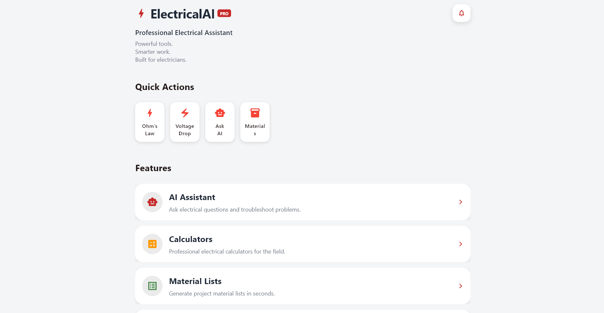


---

## 🤖 AI Assistant

Ask electrical questions using natural language and receive AI-powered responses through the integrated backend.


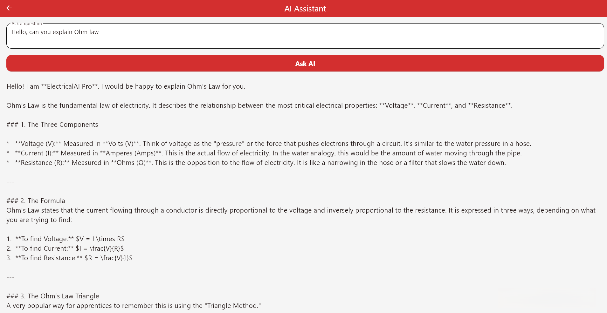


---

## ⚡ Ohm's Law Calculator

Quickly solve for voltage, current, resistance, or power using any two known values.


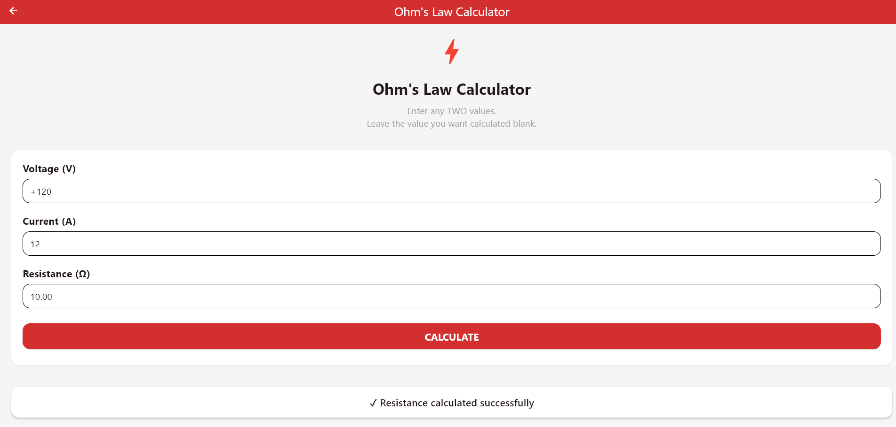


---

## ⚡ Voltage Drop Calculator

Calculate voltage drop using conductor size, circuit length, material type, and electrical load.


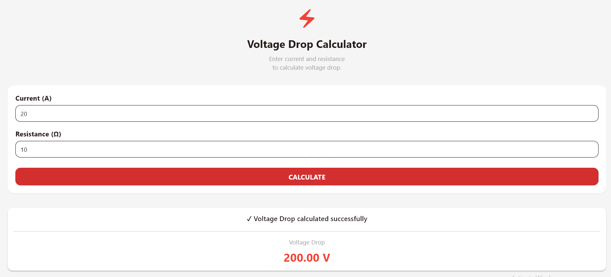


---

## ⚡ Wire Ampacity Calculator

Determine conductor ampacity using wire size and installation information.


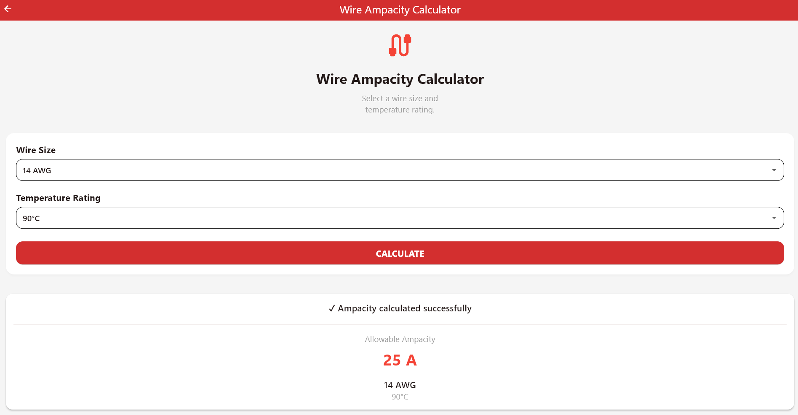


---

## ⚡ Box Fill Calculator

Calculate minimum electrical box volume based on conductor count and installed devices.


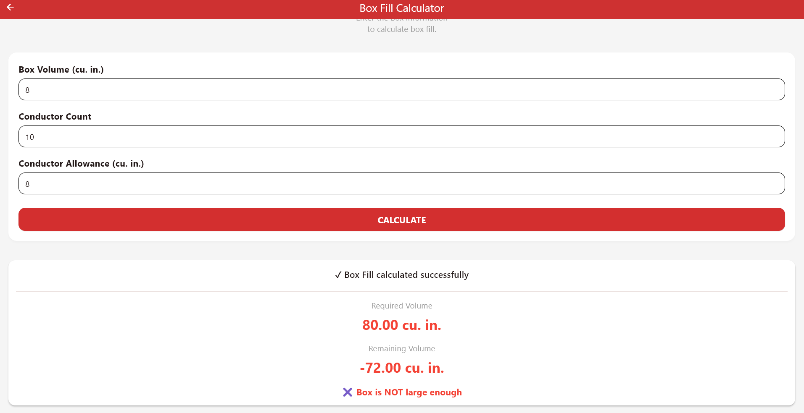


---

## ⚡ Conduit Fill Calculator

Determine conduit fill percentages for properly sized conduit installations.


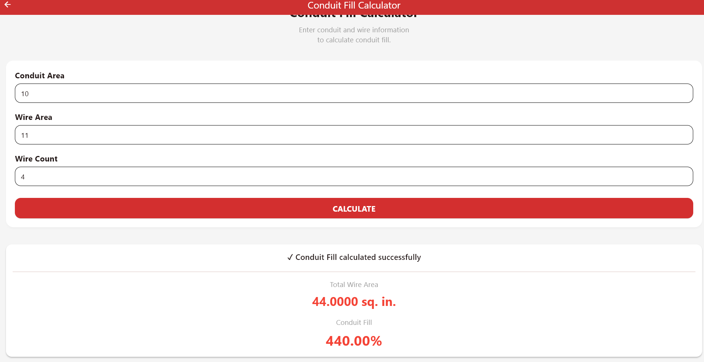


---

## ⚡ Circuit Load Calculator

Estimate electrical circuit loading for more accurate circuit planning.


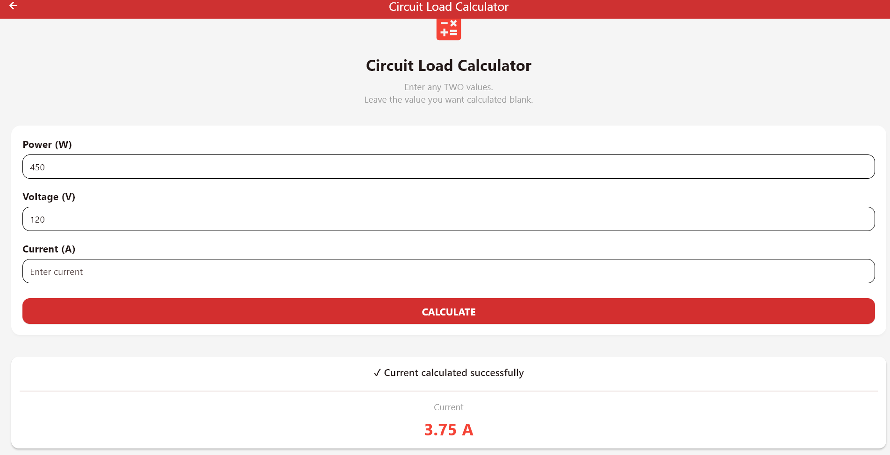


---

## 📋 Material Lists

Organize project materials and prepare for future estimating capabilities.


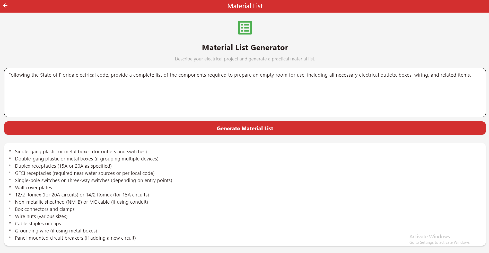


---

## ⚙️ Settings

Customize application preferences that remain available every time the application starts.


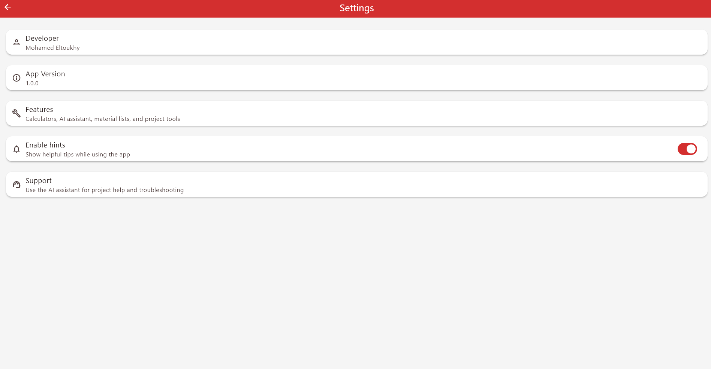


---

# 🚀 Installation

ElectricalAI Pro is currently supported on **Windows**.

To build and run the project locally, you'll need the following tools installed.

## Requirements

- Python 3.12 or newer
- Flutter SDK
- Git
- Visual Studio 2022 (Desktop development with C++)
- Visual Studio Code (recommended)

---

## Clone the Repository

```bash
git clone https://github.com/L2kee/ElectricalAI-Pro.git
cd ElectricalAI-Pro
```

---

# 🚀 Running ElectricalAI Pro

After cloning the repository and installing the project dependencies, start the application from the project root:

```bash
python launcher.py
```

The launcher automatically:

- Detects Development or Release mode
- Starts the FastAPI backend
- Waits for the backend to become ready
- Launches the Flutter desktop application
- Monitors the application while it is running
- Shuts down the backend cleanly when the application closes

## Development Notes

If you are modifying backend dependencies:

```bash
cd backend
pip install -r requirements.txt
```

If you are modifying the Flutter frontend:

```bash
cd frontend
flutter pub get
```

The launcher will use your local development environment automatically.

---

# 🧪 Testing

ElectricalAI Pro includes both frontend and backend validation tools.

## Flutter

Analyze the Flutter project for warnings and errors.

```bash
flutter analyze
```

---

## Backend

From the project root:

```bash
python -m pytest
```

## Flutter calculators

```bash
cd frontend
flutter test
```

---

# 🔌 REST API Endpoints

ElectricalAI Pro exposes several REST endpoints through the FastAPI backend.

| Endpoint | Purpose |
|----------|---------|
| `/health` | Backend readiness |
| `/chat` | AI Assistant (conversation history) |
| `/material-list` | Structured material list |
| `/ohms-law` | Ohm's Law |
| `/voltage-drop` | Voltage drop |
| `/wire-ampacity` | Wire ampacity |
| `/box-fill` | Box fill |
| `/conduit-fill` | Conduit fill |
| `/circuit-load` | Circuit load |

Every endpoint is automatically documented through FastAPI's built-in Swagger interface, making development, testing, and future expansion significantly easier.

---
# 🌟 Version 1.0.1 Highlights

ElectricalAI Pro Version **1.0.0** represents the first public release of the project and establishes the foundation for future development.

This release combines artificial intelligence, professional electrical calculators, and a modern Windows desktop interface into a single application designed specifically for electricians, apprentices, students, and electrical professionals.

### Included in Version 1.0.0

- 🤖 AI-Powered Electrical Assistant
- ⚡ Ohm's Law Calculator
- ⚡ Voltage Drop Calculator
- ⚡ Wire Ampacity Calculator
- ⚡ Box Fill Calculator
- ⚡ Conduit Fill Calculator
- ⚡ Circuit Load Calculator
- 📋 Material Lists
- ⚙️ Persistent Application Settings
- 🖥️ Windows Desktop Application
- 🚀 Development Launcher (launcher.py)
- 🔗 FastAPI REST Backend
- 📖 Interactive Swagger API Documentation

---

# 🗺️ Roadmap

ElectricalAI Pro is an actively developing project. While Version 1.0.0 provides a strong desktop foundation, many additional features are planned as the application continues to grow.

## ✅ Version 1.0.0 (Completed)

- Complete Windows desktop application
- AI-powered Electrical Assistant
- Six professional electrical calculators
- Material Lists foundation
- Persistent user settings
- REST API backend
- Modular application architecture
- GitHub documentation
- Windows desktop deployment

---

## 🚀 Planned for Version 2

Future development will focus on expanding ElectricalAI Pro into a complete AI-powered productivity platform for electricians.

### AI Improvements

- More advanced AI responses
- Conversation history
- Improved electrical context
- Smarter troubleshooting assistance

### Electrical Tools

- Additional electrical calculators
- Unit conversion tools
- NEC reference tools *(without reproducing copyrighted NEC content)*
- Voltage drop comparison tools
- Motor and transformer calculations

### Productivity

- Saved calculations
- Favorites
- Project management tools
- Material cost estimating
- PDF export
- CSV export
- Improved reporting

### Mobile Applications

- 📱 Android application
- 📱 iPhone (iOS) application

### Future Ideas

- Cloud synchronization
- User accounts
- Team collaboration
- Drawing and PDF analysis
- Voice input
- Offline AI capabilities

The roadmap will continue evolving as the project grows and new ideas are explored.

---

# 👨‍💻 About the Developer

ElectricalAI Pro was designed and developed by **Mohamed Eltoukhy** as a real-world software engineering project that combines practical electrical industry knowledge with modern software development.

Rather than building another tutorial application, this project was created to solve a problem encountered in the skilled trades: the need to constantly switch between calculators, reference materials, AI tools, and notes throughout the workday.

Developing ElectricalAI Pro provided hands-on experience with:

- Flutter
- Dart
- Python
- FastAPI
- REST API development
- AI integration
- Desktop application development
- Git and GitHub
- Software architecture
- UI/UX design
- Client-server application development

Every feature in Version 1.0.0 was designed, implemented, tested, and documented as part of building a maintainable, scalable application that can continue growing over time.

This project represents both a practical tool for the electrical industry and a demonstration of modern full-stack software engineering skills.

---

# 🤝 Feedback

Feedback is always welcome.

If you discover a bug, have an idea for a future feature, or would like to suggest an improvement, please open a GitHub Issue.

Constructive feedback helps make ElectricalAI Pro better for everyone.

---

# 📄 License

ElectricalAI Pro is released under the **ElectricalAI Pro Community License v1.0**.

You are welcome to:

- ✅ View the source code
- ✅ Learn from the project
- ✅ Modify the project for your own personal use
- ✅ Use the software for educational purposes
- ✅ Study the architecture and implementation

You may **NOT**:

- ❌ Sell this software
- ❌ Sell modified versions of this software
- ❌ Redistribute this software
- ❌ Publish modified versions
- ❌ Re-license this software
- ❌ Incorporate this project into commercial software
- ❌ Use this project or any substantial portion of its source code for commercial purposes without prior written permission from the copyright owner

See the included **LICENSE** file for the complete license terms.

---

# ⭐ Support the Project

If you found ElectricalAI Pro interesting or helpful, consider:

- ⭐ Starring the repository
- 🐞 Reporting bugs
- 💡 Suggesting new features
- 📢 Sharing feedback

Your support helps guide future development and makes the project even better.

---

<p align="center">

# ⚡ ElectricalAI Pro

**Building smarter tools for the electrical industry through modern software engineering and artificial intelligence.**

**Version 1.0.0**

Designed and developed by **Mohamed Eltoukhy**

</p>